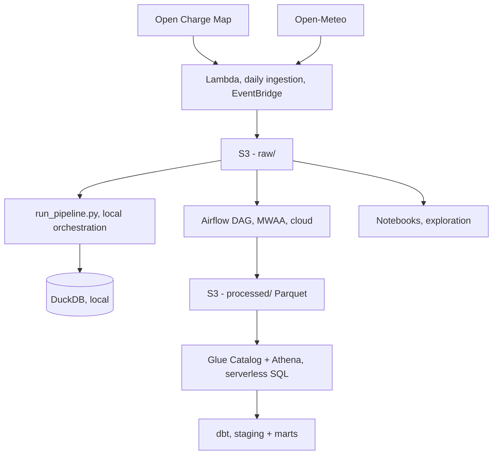
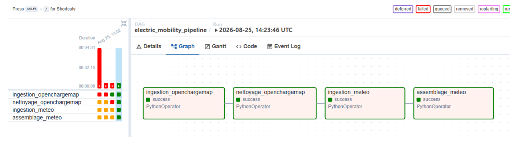
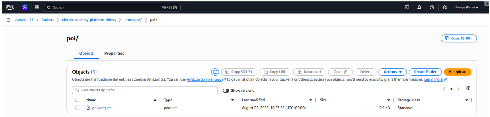
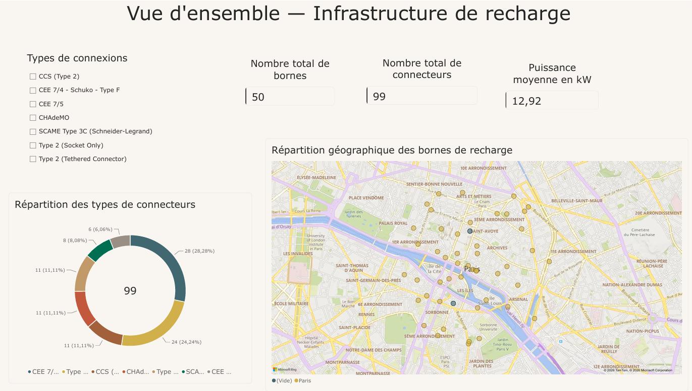
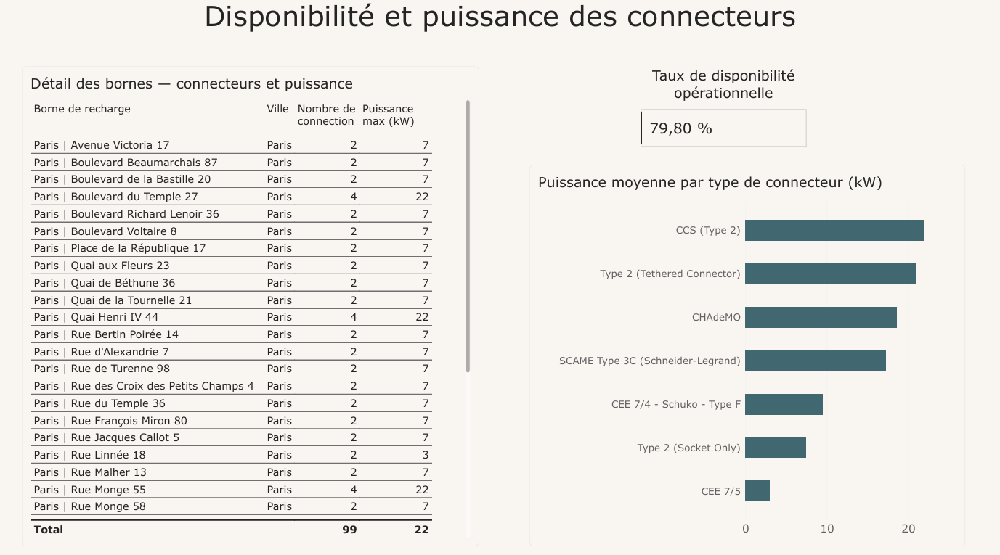

# Electric Mobility Platform

🇬🇧 English | 🇫🇷 [Français](README.md)

[](https://github.com/thcarole1/electric-mobility-platform/actions/workflows/tests.yml)

End-to-end data pipeline, from API ingestion to cloud orchestration,
built around electric mobility and energy data.

Portfolio project built as part of a professional reconversion into
a **Data Engineer** role, after 10+ years in the automotive industry.

---

## Understand this project in 2 minutes (no technical jargon)

**The problem this project solves**: finding electric vehicle
charging stations requires reliable, up-to-date, easily accessible
data. This project builds, automates, and monitors the entire chain
that makes this possible.

**What it does, concretely, every night, without human intervention:**
1. It automatically fetches up-to-date data (charging station
   locations, weather) from public sources
2. It cleans and validates this data (types, consistency)
3. It stores it in a secure storage space (the Amazon cloud)
4. If a step fails, it automatically sends me an email alert, like a
   smoke detector, but for a computer program
5. The data is then browsable in a visual dashboard (maps, charts,
   indicators)

**Why this is exactly what a Data Engineer does**: a business rarely
needs raw data, it needs reliable data, automatically kept up to
date, and easy to use for decision-making. That is precisely what
this project demonstrates, end to end.

**The link with my background**: after more than 10 years in the
automotive industry (electric machine development, procurement), I
found the same demand for rigor and reliability in this field,
except here it is no longer a mechanical part that must not fail,
but a data pipeline.

---

## At a glance

- **2 real data sources** ingested daily (Open Charge Map,
  Open-Meteo), automated via **AWS Lambda + EventBridge**
- **S3 data lake** queryable in SQL via **Glue Catalog + Athena**
- **Tested transformations** with **dbt** (sources, models, tests)
- **Airflow orchestration** via **Amazon MWAA**, deployed and
  validated on a real cloud environment: see [the most challenging
  part of this project](#the-most-challenging-part-of-this-project-mwaa)
- **Infrastructure as Code** with **Terraform** (32 resources, remote
  S3 backend), pipeline **containerized with Docker**, and **CI/CD**
  via GitHub Actions (automated tests, `terraform plan` on every PR)
- **68 unit tests**, **27 Architecture Decision Records** documenting
  every technical choice
- Local **DuckDB** database for fast exploration, no cloud dependency
  needed to iterate

## Table of contents

- [Architecture](#architecture)
- [Tech stack](#tech-stack)
- [Repository structure](#repository-structure)
- [Running the project](#running-the-project)
- [The most challenging part of this project: MWAA](#the-most-challenging-part-of-this-project-mwaa)
- [Business restitution: Power BI dashboard](#business-restitution-power-bi-dashboard)
- [Decision history (ADR)](#decision-history-adr)
- [Roadmap](#roadmap)

---

## Architecture



Two orchestration paths coexist intentionally:
- **`run_pipeline.py`**: full local pipeline (ingestion, cleaning,
  DuckDB, simulated sessions), fast to iterate on
- **MWAA DAG**: same logic, adapted to the constraints of a managed
  cloud environment (see below)

## Tech stack

| Area | Tools |
|---|---|
| Language | Python 3.12 |
| Data processing | Polars, DuckDB |
| Storage | S3, Parquet |
| Catalog & querying | AWS Glue Catalog, Athena |
| Transformation | dbt (dbt-duckdb) |
| Serverless orchestration | AWS Lambda, EventBridge Scheduler |
| Cloud orchestration | Amazon MWAA (Apache Airflow 2.10.3) |
| Testing | pytest (68 tests), dbt tests |
| Network infrastructure | VPC, private subnets, VPC Endpoints, NAT Gateway |
| Infrastructure as Code | Terraform (remote S3 backend, 4 modules) |
| Containerization | Docker (multi-stage build) |
| CI/CD | GitHub Actions (tests, terraform plan, branch protection) |

## Repository structure

```
electric-mobility-platform/
├── src/
│   ├── emp_common/     # generic I/O functions (files, S3)
│   ├── ingestion/       # API calls (Open Charge Map, Open-Meteo)
│   ├── cleaning/        # cleaning, normalization, assembly
│   ├── warehouse/       # DuckDB loading
│   └── simulation/      # charging session generator
├── lambda_functions/     # Lambda handlers (daily ingestion)
├── mwaa_dags/            # Airflow DAG + dependencies (MWAA)
├── electric_mobility_dbt/ # dbt models and tests
├── terraform/             # infrastructure as code (4 modules)
├── .github/workflows/      # CI/CD (tests, terraform plan)
├── Dockerfile              # pipeline containerization (multi-stage)
├── notebooks/            # exploration, module usage examples
├── scripts/              # build scripts (Lambda packages, MWAA plugins)
├── tests/                # 68 unit tests (pytest)
├── run_pipeline.py       # full local orchestration, one command
└── docs/adr/             # 27 Architecture Decision Records
```

## Running the project

```bash
python -m venv .venv
source .venv/bin/activate   # Windows: .venv\Scripts\activate
pip install -e ".[dev]"
```

Copy `.env.example` to `.env` and fill in:
- `OCM_API_KEY` (Open Charge Map API key)
- `AWS_ACCESS_KEY_ID`, `AWS_SECRET_ACCESS_KEY`, `AWS_REGION`

**Run the tests:**
```bash
pytest tests/
```

**Run the full local pipeline** (ingestion, cleaning, DuckDB, weather,
simulated sessions, about 40 seconds):
```bash
python run_pipeline.py
```

---

## The most challenging part of this project: MWAA

Deploying an Airflow pipeline on Amazon MWAA was, by far, the
largest time investment of this project: six debugging sessions, a
dozen environment creation attempts, one AWS support ticket. Not
because of a design mistake, but because several critical behaviors
of the service are not documented anywhere in a centralized way:

- Two **internal VPC endpoints**, dynamically generated at each
  environment creation, without which the deployment stays stuck
  indefinitely
- **Each MWAA component** (Webserver, Scheduler/Worker, DAG
  Processor) has a **fully isolated Python environment**: a
  successful install on one never benefits the others
- A private network without a NAT Gateway cannot reach **any**
  public resource, neither PyPI nor the weather API itself

The method that made progress possible: diagnosis via CloudWatch
Logs Insights, an AWS support script patched on the spot (a bug was
identified and fixed locally), a Systems Manager automation to test
real network connectivity, and a support ticket for the final
discovery.

The result: a DAG that runs successfully end to end on a real MWAA
environment, producing up-to-date data on S3.





**To go further:**
- [ADR-021](docs/adr/en/021-mwaa-orchestration.md): complete timeline
  of the ten root causes identified and fixed
- Standalone MWAA best-practices guide (network pitfalls, component
  isolation, quick-start checklist), capitalized for any future
  project, available on request

## Business restitution: Power BI dashboard

A Power BI dashboard, connected directly to Athena via ODBC, gives
the data produced by the pipeline a visible destination, closing the
loop between ingestion, transformation, and business use.

**Page 1, Overview**: geographic map of charging stations,
breakdown of connector types, key indicators (number of stations,
number of connectors, average power), with an interactive filter by
connector type.



**Page 2, Availability and power**: operational availability rate
of connectors, average power by type, sortable detail table by
station.



Setting up this connection revealed a type inconsistency in the
`poi_id` column of the weather data, breaking Athena queries. See
[ADR-026](docs/adr/en/026-dashboard-powerbi-athena.md) for the full
diagnosis and fix.

## Decision history (ADR)

Every significant technical decision is documented in
[`docs/adr/`](docs/adr/) (French) and
[`docs/adr/en/`](docs/adr/en/) (English), 27 decisions to date, from
normalizing a single column to full industrialization. A few notable
entry points:

- [ADR-007](docs/adr/en/007-extraction-module-commun-io.md): factoring
  out a common module shared between two sources
- [ADR-014](docs/adr/en/014-lambda-meteo-et-comptes-iam.md): separating
  IAM accounts (administration vs. application)
- [ADR-019](docs/adr/en/019-glue-athena-datalake.md): setting up the S3
  + Athena data lake
- [ADR-020](docs/adr/en/020-script-pipeline-local.md): local
  orchestration script, filling the gap before a DAG existed
- [ADR-021](docs/adr/en/021-mwaa-orchestration.md): the MWAA project in
  detail
- [ADR-022](docs/adr/en/022-terraform-infrastructure-as-code.md):
  importing existing infrastructure under Terraform
- [ADR-023](docs/adr/en/023-docker-containerisation.md): containerizing
  the pipeline with Docker
- [ADR-024](docs/adr/en/024-ci-cd-github-actions.md): CI/CD and remote
  Terraform backend
- [ADR-025](docs/adr/en/025-monitoring-cloudwatch-sns.md): pipeline
  observability (CloudWatch Alarms, SNS)
- [ADR-026](docs/adr/en/026-dashboard-powerbi-athena.md): Power BI
  dashboard and a data type inconsistency fix
- [ADR-027](docs/adr/en/027-validation-schema-donnees.md): schema
  validation at the source

## Roadmap

- ✅ **Phase 0-3**: Scoping, local + AWS MVP, source enrichment, full
  AWS extension (Lambda, dbt, data lake, MWAA)
- ✅ **Phase 5**: Industrialization, full infrastructure under
  Terraform (32 resources, remote S3 backend), pipeline containerized
  with Docker (multi-stage build), CI/CD with GitHub Actions
  (automated tests, branch protection, `terraform plan` on every Pull
  Request touching the infrastructure)
- ✅ **Phase 6**: Observability, CloudWatch alarms on ingestion
  failures, SNS email notifications, validated under real conditions
  following an Open Charge Map service outage
- ✅ **Phase 7**: Business restitution, two-page Power BI dashboard,
  connected directly to Athena
- ✅ **Phase 8**: Data quality, schema validation at the source,
  applied on both execution paths of the pipeline
- ⬜ **Phase 4**: Data Science (anomaly detection, forecasting on
  simulated charging sessions)

---

*Project under active development, last updated August 2026.*
