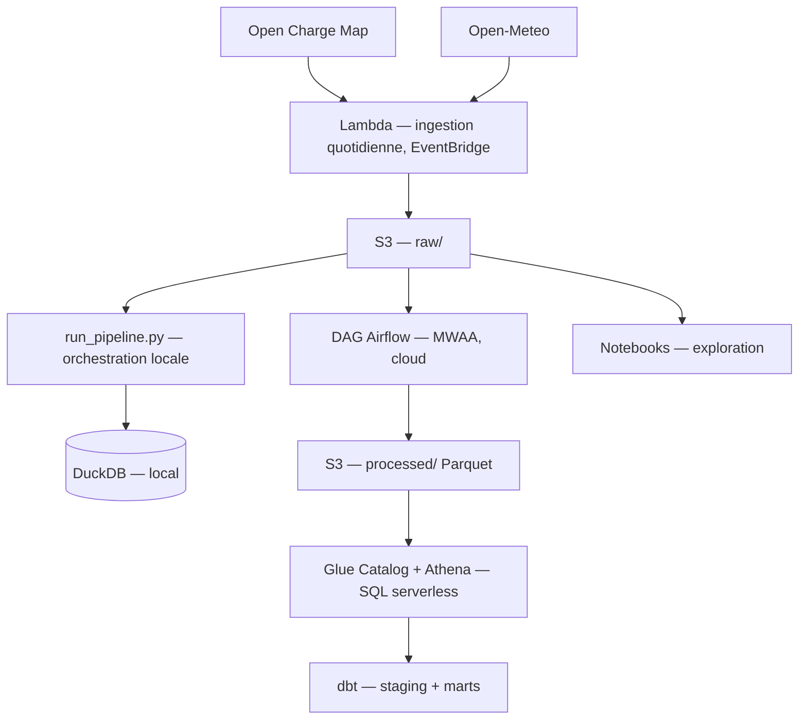

# Electric Mobility Platform

Pipeline de données de bout en bout — de l'ingestion API à
l'orchestration cloud — construit autour de la mobilité électrique et
de l'énergie.

Projet de portfolio réalisé dans le cadre d'une reconversion
professionnelle vers un poste **Data Engineer**, après 10+ ans dans
l'industrie automobile.

---

## En bref

- **2 sources de données réelles** ingérées quotidiennement (Open
  Charge Map, Open-Meteo), automatisées via **AWS Lambda + EventBridge**
- **Data lake S3** interrogeable en SQL via **Glue Catalog + Athena**
- **Transformations testées** avec **dbt** (sources, modèles, tests)
- **Orchestration Airflow** via **Amazon MWAA**, déployée et validée
  sur un vrai environnement cloud — voir [le chantier le plus
  formateur du projet](#le-chantier-le-plus-formateur--mwaa)
- **63 tests unitaires**, **21 Architecture Decision Records**
  documentant chaque choix technique
- Base locale **DuckDB** pour l'exploration rapide, sans dépendance
  cloud pour itérer

## Sommaire

- [Architecture](#architecture)
- [Stack technique](#stack-technique)
- [Structure du dépôt](#structure-du-dépôt)
- [Lancer le projet](#lancer-le-projet)
- [Le chantier le plus formateur : MWAA](#le-chantier-le-plus-formateur--mwaa)
- [Historique des décisions (ADR)](#historique-des-décisions-adr)
- [Roadmap](#roadmap)

---

## Architecture



Deux chemins d'orchestration coexistent volontairement :
- **`run_pipeline.py`** — pipeline complet en local (ingestion →
  nettoyage → DuckDB → sessions simulées), rapide à itérer
- **DAG MWAA** — même logique, adaptée aux contraintes d'un
  environnement cloud managé (voir plus bas)

## Stack technique

| Domaine | Outils |
|---|---|
| Langage | Python 3.12 |
| Traitement de données | Polars, DuckDB |
| Stockage | S3, Parquet |
| Catalogue & requêtage | AWS Glue Catalog, Athena |
| Transformation | dbt (dbt-duckdb) |
| Orchestration serverless | AWS Lambda, EventBridge Scheduler |
| Orchestration cloud | Amazon MWAA (Apache Airflow 2.10.3) |
| Tests | pytest (63 tests), tests dbt |
| Infra réseau | VPC, sous-réseaux privés, VPC Endpoints, NAT Gateway |

## Structure du dépôt

```
electric-mobility-platform/
├── src/
│   ├── emp_common/     # fonctions génériques d'E/S (fichiers, S3)
│   ├── ingestion/       # appels API (Open Charge Map, Open-Meteo)
│   ├── cleaning/        # nettoyage, normalisation, assemblage
│   ├── warehouse/       # chargement DuckDB
│   └── simulation/      # générateur de sessions de recharge
├── lambda_functions/     # handlers Lambda (ingestion quotidienne)
├── mwaa_dags/            # DAG Airflow + dépendances (MWAA)
├── electric_mobility_dbt/ # modèles et tests dbt
├── notebooks/            # exploration, exemples d'usage des modules
├── scripts/              # scripts de build (packages Lambda, plugins MWAA)
├── tests/                # 63 tests unitaires (pytest)
├── run_pipeline.py       # orchestration locale complète, une commande
└── docs/adr/             # 21 Architecture Decision Records
```

## Lancer le projet

```bash
python -m venv .venv
source .venv/bin/activate   # Windows : .venv\Scripts\activate
pip install -e ".[dev]"
```

Copier `.env.example` en `.env` et renseigner :
- `OCM_API_KEY` (clé Open Charge Map)
- `AWS_ACCESS_KEY_ID`, `AWS_SECRET_ACCESS_KEY`, `AWS_REGION`

**Lancer les tests :**
```bash
pytest tests/
```

**Lancer le pipeline complet en local** (ingestion → nettoyage →
DuckDB → météo → sessions simulées, ~40 secondes) :
```bash
python run_pipeline.py
```

---

## Le chantier le plus formateur : MWAA

Déployer un pipeline Airflow sur Amazon MWAA a représenté, de loin,
l'investissement en temps le plus important de ce projet — six
sessions de débogage, une dizaine de tentatives de création
d'environnement, un ticket de support AWS. Pas à cause d'une erreur de
conception, mais parce que plusieurs comportements critiques du
service ne sont documentés nulle part de façon centralisée :

- Deux **endpoints VPC internes**, générés dynamiquement à chaque
  création d'environnement, sans lesquels le déploiement reste bloqué
  indéfiniment
- **Chaque composant MWAA** (Webserver, Scheduler/Worker, DAG
  Processor) a un **environnement Python totalement isolé** — une
  installation réussie sur l'un ne profite jamais aux autres
- Un réseau privé sans NAT Gateway ne peut atteindre **aucune**
  ressource publique — ni PyPI, ni l'API météo elle-même

La méthode qui a permis d'avancer : diagnostic via CloudWatch Logs
Insights, un script de support AWS corrigé sur place (bug identifié
et patché localement), une automatisation Systems Manager pour tester
la connectivité réseau réelle, et un ticket de support pour la
découverte finale.

Le résultat : un DAG qui s'exécute avec succès de bout en bout sur un
environnement MWAA réel, produisant des données à jour sur S3.

**Pour aller plus loin :**
- [ADR-021](docs/adr/021-mwaa-orchestration.md) — chronologie complète
  des dix causes racines identifiées et corrigées
- Guide autonome de bonnes pratiques MWAA (pièges réseau, isolation
  des composants, checklist de démarrage) — capitalisé pour tout futur
  projet, disponible sur demande

## Historique des décisions (ADR)

Chaque choix technique significatif est documenté dans
[`docs/adr/`](docs/adr/) — 21 décisions à ce jour, de la normalisation
d'une colonne à l'orchestration cloud complète. Quelques points
d'entrée notables :

- [ADR-007](docs/adr/007-extraction-module-commun-io.md) — factoriser
  un module commun entre deux sources
- [ADR-014](docs/adr/014-lambda-meteo-et-comptes-iam.md) — séparation
  des comptes IAM (administration vs applicatif)
- [ADR-019](docs/adr/019-glue-athena-datalake.md) — mise en place du
  data lake S3 + Athena
- [ADR-020](docs/adr/020-script-pipeline-local.md) — script
  d'orchestration locale, palliant l'absence d'un DAG à l'époque
- [ADR-021](docs/adr/021-mwaa-orchestration.md) — le chantier MWAA en
  détail

## Roadmap

- ✅ **Phase 0-3** — Cadrage, MVP local + AWS, enrichissement des
  sources, extension AWS complète (Lambda, dbt, data lake, MWAA)
- ⬜ **Phase 4** — Data Science (détection d'anomalies, prévision sur
  les sessions de recharge simulées)
- ⬜ **Phase 5** — Industrialisation (Terraform, Docker, CI/CD)

---

*Projet en développement actif — dernière mise à jour août 2026.*
